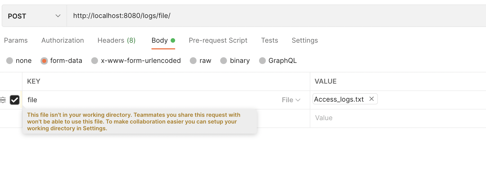
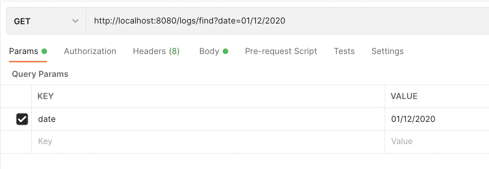

# AssessmentSandbox

Commands to setup 

git clone https://github.com/SikanderMehmood/AssessmentSandbox.git

Open IDE , let dependencies get resolved (if any error , run 'gradle clean build')

Go to postman and save logs  from file "Access_logs.txt" (Present in root directory)

Project is using h2 in memory database.

**http://localhost:8080/logs/file/**

Sample GET calls

**http://localhost:8080/logs/find?date=01/12/2020**

**http://localhost:8080/logs/find?date=02/12/2020**

**http://localhost:8080/logs/find?date=03/12/2020** 

